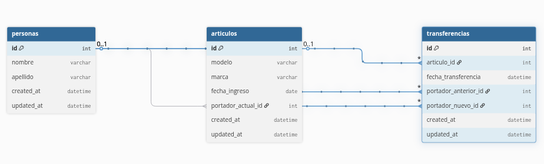

# 🏢 Sistema de Inventario


Aplicación web para **gestionar artículos y personas**, incluyendo **transferencias de portadores**, desarrollada en **Ruby on Rails 8** con **SQLite**.

---

## 🚀 Instalación

1. Clonar el repositorio:

```bash
git clone https://github.com/FrancoLadronDeGuevara/inventory-tech-sed.git

cd inventory-tech-sed
```

2. Instalar dependencias:
```bash
bundle install
```

3. Crear y preparar la base de datos:
```bash
rails db:create
rails db:migrate
rails db:seed
```

4. Ejecutar el servidor:
```bash
rails server
```

5. Abrir en el navegador:
```bash
http://localhost:3000

```


## 🎨 Decisiones de diseño

UI/UX: Simple y funcional, con layout dashboard común.
Se priorizó un flujo claro para listar, agregar y transferir artículos y personas.
Los mockups fueron manuscritos por rapidez, sin uso de Figma.

### Modelo de datos:

* Artículo: modelo, marca, fecha_ingreso, portador_actual

* Persona: nombre, apellido, artículos

* Transferencia: articulo, portador_anterior, portador_nuevo, fecha_transferencia


### Validaciones:

* Artículos no pueden tener fecha de ingreso futura.

* Marca y modelo obligatorios.

* Personas requieren nombre y apellido.

* Seeds: Incluyen 4 personas, 5 artículos y 6 transferencias, usuarios para login.

## 📊 Modelo de datos

* Cada artículo tine un **portador actual** y mantiene historial de portadores.
* Cada persona puede tener **cero o más articulos** y mantiene historial de artículos portados.
* Un artículo puede ser transferido de una persona a otra.
* Se debe mantener un **historial de portadores** por artículo.
* Se debe mantener un **historial de artículos portados** por persona.



## 📋 Planificación

El proyecto se organizó en Trello: [Tablero](https://trello.com/b/y4bbirk7/inventory-system).

* Pasos principales:

    * Diseño de mockups y modelo de datos (manuscrito).

    * Creación de modelos y migraciones.
    
    * Seeds de ejemplo para pruebas.

    * Desarrollo de login para autenticado de usuario básicos (admin/usuario).

    * Desarrollo de controladores y vistas CRUD.

    * Implementación de transferencias y registro de historial.


## Testeo con RSpec (modelos y request specs).

Ajustes finales de UI y validaciones.

## ⚙️ Funcionalidades

* Listar artículos, personas y transferencias.

* Detalle de artículo y persona con historial.

* Crear artículos, personas y transferencias.

* Seeds de ejemplo para pruebas iniciales.

* Export/Import CSV completo de articulos, personas y transferencias.

* Login básico con autenticación Rails 8.

## 🧪 Pruebas automatizadas

RSpec cubre:

* Validaciones de modelos (Articulo, Persona, Transferencia).

* Registro de transferencias y relaciones.

* Requests de vistas principales.

```bash
Ejecutar tests:

bundle exec rspec

```

## 📄 Notas adicionales

* La aplicación se desarrolló priorizando claridad y mantenibilidad.

* Las decisiones de diseño fueron rápidas y basadas en mockups manuscritos.

* Las funcionalidades opcionales faltantes pueden implementarse sobre la base actual sin grandes cambios.


---